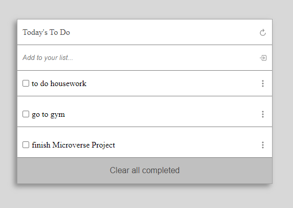

# To do list

> In this project, you will see a simple HTML list of To Do tasks.

## Built With

- Major languages: HTML, CSS, JavaScript;
- Technologies used: Git, Github, Webpack;

## Live Demo

[Live Demo Link](https://livedemo.com)

## Authors

👤 **Author1**

- GitHub: [@olivercoimbra](https://github.com/oliverSCZ)
- Twitter: [@olivercoimbra](https://twitter.com/olivercoimbra)
- LinkedIn: [olivercoimbra](https://linkedin.com/in/olivercoimbra)

## 🤝 Contributing

Contributions, issues, and feature requests are welcome!

Feel free to check the [issues page](../../issues/).

## Show your support

Give a ⭐️ if you like this project!

## Acknowledgments

- Microverse project

## 📝 License

This project is [MIT](./MIT.md) licensed.
